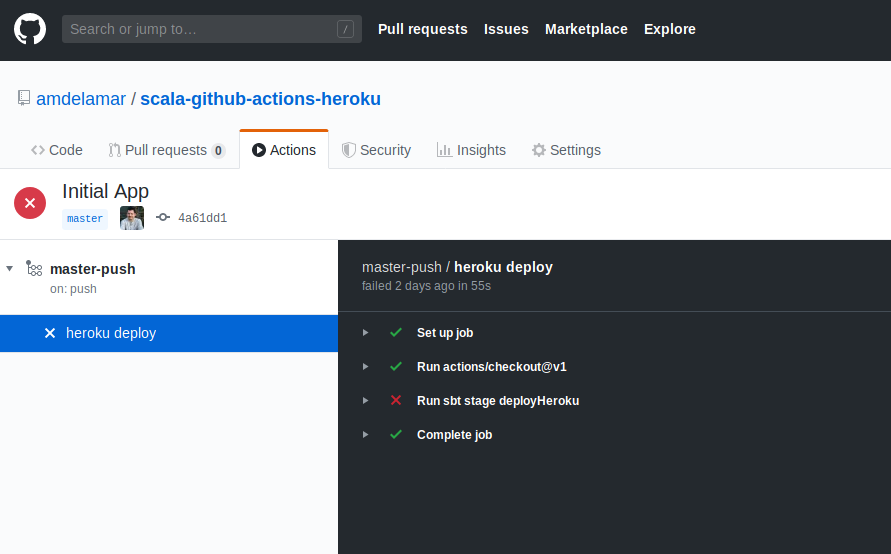
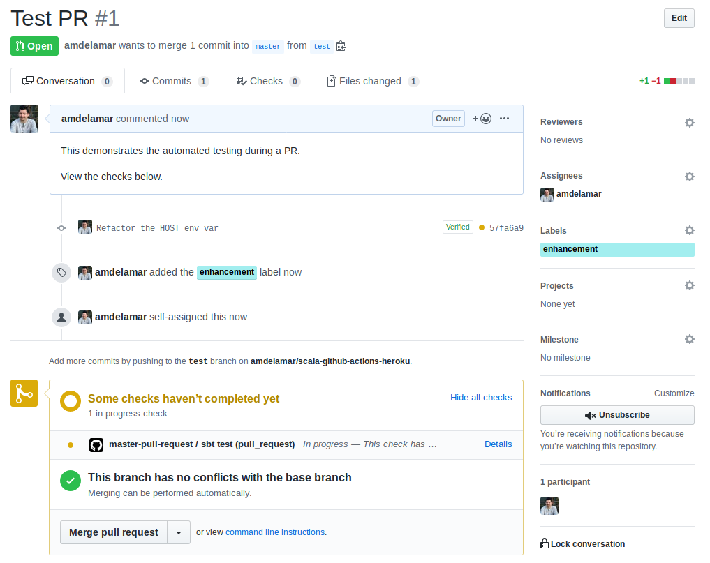

We'll here's a quick guide on how to continuously run `sbt test` on every pull request, and after merging deploy it to Heroku.
And we' do this all within the comfort of GitHub, using their automation tool called [GitHub Actions](https://github.com/features/actions).

> **TL;DR:** If you want to skip everything, here's [the git repo](https://github.com/amdelamar/scala-github-actions-heroku). 👍️

### Requirements

Things you'll need:

- [jdk 8](https://adoptopenjdk.net/) or newer
- [sbt](https://www.scala-sbt.org/) for building Scala apps
- [git](https://git-scm.com/)
- [GitHub](https://github.com) account
- [Heroku](https://heroku.com) account

What you DON'T need:

- Heroku CLI _...We'll use a sbt plugin instead._

You can easily swap out Heroku for your favorite platform-as-a-service.
But I like to use Heroku for doing rapid prototyping, testing, or live demos.

### Init Sbt

Let's setup a simple Scala app with some tests using Scalatest. If you have a Scala app already,
skip to the next step.

```bash
$ sbt new akka/akka-http-quickstart-scala.g8
```

This command helps you start a new sbt project from a few simple questions. Just name your project
and press `Enter` several times to accept the defaults.

```bash
$ sbt new akka/akka-http-quickstart-scala.g8
[info] Set current project to test (in build file:/home/amdelamar/workspace/)
[info] Set current project to test (in build file:/home/amdelamar/workspace/)

This is a seed project which creates a basic build for an Akka HTTP
application using Scala.

name [My Akka HTTP Project]: my-scala-app
scala_version [2.13.1]:
akka_http_version [10.1.10]:
akka_version [2.6.0]:
organization [com.example]:
package [com.example]:

Template applied in /home/amdelamar/workspace/./my-scala-app
```

### Init Repo

Open the app up and start a new git repo like so.
Or using GitHub to create it and clone it locally works fine too.

```bash
# initalize a new repo
$ mkdir my-scala-app # or whatever you called it
$ cd my-scala-app
$ git init
```

### Edit the Project

We'll need to modify this project to support Heroku deployments and GitHub Action workflows.

First, we'll need two more plugins:

```scala
// add these to project/plugins.sbt
addSbtPlugin("com.typesafe.sbt" % "sbt-native-packager" % "1.3.25")
addSbtPlugin("com.heroku" % "sbt-heroku" % "2.1.2")
```

One plugin is for packaging your Scala app into a native package format, like a
`.tar`, `.zip`, or `.jar` file, depending on your OS you wish to target. The
other plugin is for publishing your packaged Scala app to Heroku using their APIs.
This allows us to easily deploy in one command which you will see in a bit.

Ok, now add these at the bottom of the `build.sbt` file.

```scala
// build.sbt
// ...

enablePlugins(JavaAppPackaging)

// heroku deployment configs
herokuAppName in Compile := "my-scala-app" // unique Heroku app name
herokuJdkVersion in Compile := "1.8"
herokuConfigVars in Compile := Map(
  "HOST" -> "0.0.0.0"
)
herokuProcessTypes in Compile := Map(
  "web" -> "target/universal/stage/bin/my-scala-app" // project name
)
```

> _If you've used Heroku before, you might decide to add a Procfile to your repo.
> This file is normally required for Heroku apps, but we use the sbt-heroku plugin
> to generate one for us during deployment._

Now the app needs to support reading from two environment variables to override
the host and port options for our Akka Http server. This lets Heroku bind the
application container correctly so it can be reachable via their generated url
they use. "0.0.0.0" is required for the host, and typically the next random
available port is chosen, which means we can't always use port 8080 for deployment.

Next up, The main class `QuickstartApp.scala` has these lines but...

```scala
//#main-class
object QuickstartApp {
  //#start-http-server
  private def startHttpServer(routes: Route, system: ActorSystem[_]): Unit = {
    // Akka HTTP still needs a classic ActorSystem to start
    implicit val classicSystem: akka.actor.ActorSystem = system.toClassic
    import system.executionContext

    val futureBinding = Http().bindAndHandle(routes, "localhost", 8080)
  }
```

...we need to modify it with the two environment variables:

```scala
//#main-class
object QuickstartApp {
  //#start-http-server
  private def startHttpServer(routes: Route, system: ActorSystem[_]): Unit = {
    // Akka HTTP still needs a classic ActorSystem to start
    implicit val classicSystem: akka.actor.ActorSystem = system.toClassic
    import system.executionContext

    // Check env vars
    val HOST = sys.env.getOrElse("HOST", "localhost")
    val PORT = scala.util.Try(sys.env("PORT").toInt).getOrElse(8080)

    val futureBinding = Http().bindAndHandle(routes, HOST, PORT)
  }
```

Instead of hard-coding "0.0.0.0", we'll leave that to the `build.sbt` config.
That way, we can still `sbt run` this app for local development.

Now the final edit, before we're ready to push to GitHub.
We need to define our GitHub Actions, or workflows. These will let us control
the commands run, and what they're run on, during Pull Requests and merging.

Create these two files under this directory:

```bash
$ mkdir -p .github/workflows
$ touch .github/workflows/master-pull-request.yml
$ touch .github/workflows/master-push.yml
```

And edit them like so:

```yaml
# master-pull-request.yml
name: master-pull-request
on:
  pull_request:
    branches:
      - master
jobs:
  test:
    name: sbt test
    runs-on: ubuntu-18.04
    steps:
      - uses: actions/checkout@v1
      - name: Run sbt test
        run: |
          sbt compile
          sbt test
```

```yaml
# master-push.yml
name: master-push
on:
  push:
    branches:
      - master
jobs:
  deploy:
    name: heroku deploy
    runs-on: ubuntu-18.04
    steps:
      - uses: actions/checkout@v1
      - name: Run sbt stage deployHeroku
        env:
          HEROKU_API_KEY: ${{ secrets.HEROKU_API_KEY }}
        run: |
          sbt stage deployHeroku
```

The yamls are self-describing, but you can read [the GitHub docs](https://help.github.com/en/actions/automating-your-workflow-with-github-actions/configuring-a-workflow#creating-a-workflow-file) for more info. Here, we are simply enabling
two workflows. One triggers on every pull request opened to `master` branch. The
the other triggers on every `git push` or `merge` to `master` branch. The `jobs`
defined will run once using the defined OS (Ubuntu 18), and execute the given commands.

Feel free to edit these to do more than just the above!

### Git Push

If you've followed along correctly, you should be ready to stage, commit, and push these files.

```bash
$ git add .
$ git commit -m "init"
$ git remote add origin git@github.com:amdelamar/my-scala-app.git
$ git push -u origin master
```

And that's it!

### Heroku App & API Key

Err, actually there is one last thing.

If you go to the GitHub project's Actions tab, you might notice that first commit
produced a failing job:



The deployment command failed. I forgot to mention that you'll need to create the
app placeholder in Heroku, as well as give GitHub your Heroku API secret key,
so it can run push to Heroku on your behalf.

Open the [Heroku Dashboard](https://dashboard.heroku.com/apps) and click the "New" button
to create a new app. Give it a unique name.

> _Note: The heroku app name has to be unique, but it doesn't have to be the
> same as the project name itself. Go ahead and name it anything. But be sure
> to edit your build.sbt with the actual value once you're done._

Now you have a placeholder to deploy to. But we need that API key for letting GitHub
Actions deploy on our behalf. Go find your API key and copy it.
In Heroku, its under `Account settings` -> `API key` -> and click "Regenerate API key".

You'll have to save this key in GitHub's secrets. In the GitHub repo, go to `Settings` -> `Secrets` -> "Add new secret".
Enter it as `HEROKU_API_KEY` and paste in the secret key.

Done!

### Testing a PR

Alright, now we're ready to open a pull request and run some automated tests!

Make a new branch, push a change, and open a PR. Watch the automated checks kickoff
and update your PR with a ✔️ pass or ❌️ fail depending on the results.



After the checks pass, (assuming they pass!), merge your PR. Watch the automated
deployment trigger next. You can click on "Actions" tab and monitor it there,
or open Heroku dashboard and view the activity and logs of your app.

After it deploys successfully, you can view it at: `https://<your-app-name>.herokuapp.com`

e.g. https://my-scala-app.herokuapp.com/users

(The /users is part of the default akka g8 template we used.)

### Future TODOs

Pretty much any command that you would run on your Scala project,
you could add to a `job` in a workflow file.

Things like, linting, code coverage, packaging, publishing to Maven Central or Bintray,
publishing Docker images, and more, could easily be added here. Go wild!
